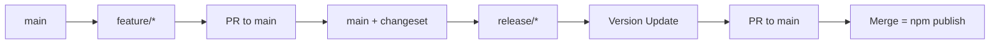

# pnpmによるパッケージ公開とリリースフロー

## なぜpnpmが公開に適しているか

### npmの問題点
- **レースコンディション**: 並列公開時に依存関係の解決に失敗
- **公開順序の制御困難**: 依存パッケージが先に公開される保証がない
- **バージョン衝突**: "You cannot publish over the previously published versions"エラー

### pnpmの解決策
- **依存順序での公開**: `pnpm publish -r`で自動的に依存順序を解決
- **workspace:*の自動変換**: 公開時に実際のバージョンに変換
- **トランザクション的な公開**: 失敗時のロールバック可能

## 基本的な公開設定

### package.jsonの必須フィールド

```json
{
  "name": "@my-org/package",
  "version": "1.0.0",
  "description": "Package description",
  "type": "module",
  "main": "dist/index.js",
  "types": "dist/index.d.ts",
  "files": [
    "dist"
  ],
  "scripts": {
    "build": "tsc --build",
    "prepublishOnly": "pnpm build"
  },
  "publishConfig": {
    "access": "public",
    "registry": "https://registry.npmjs.org/"
  }
}
```

**重要なポイント**:
- `files`: 公開するファイルを明示的に指定
- `prepublishOnly`: 公開前のビルドを保証
- `publishConfig`: スコープ付きパッケージの公開設定

### .npmignoreは使わない

```bash
# ❌ 非推奨
echo "src/" >> .npmignore
echo "tests/" >> .npmignore

# ✅ 推奨: package.jsonのfilesフィールドを使用
```

## Changesetによるバージョン管理

### Changesetの初期設定

```bash
# changesetのインストール
pnpm add -D @changesets/cli -w

# 初期化
pnpm changeset init
```

### .changeset/config.json

```json
{
  "$schema": "https://unpkg.com/@changesets/config@3.0.0/schema.json",
  "changelog": "@changesets/cli/changelog",
  "commit": false,
  "fixed": [],
  "linked": [],
  "access": "public",
  "baseBranch": "main",
  "updateInternalDependencies": "patch",
  "ignore": [],
  "privatePackages": {
    "version": true,
    "tag": false
  }
}
```

### Changesetワークフロー

```bash
# 1. 変更後にchangesetを作成
pnpm changeset

# 2. 対話形式で変更内容を記録
# - 変更したパッケージを選択
# - major/minor/patchを選択
# - 変更内容の説明を入力

# 3. changesetファイルがコミット対象に追加される
git add .changeset/xxx.md
git commit -m "feat: add new feature"

# 4. リリース時にバージョン更新
pnpm changeset version

# 5. 公開
pnpm publish -r --no-git-checks
```

## リリースフローの設計

### 推奨フロー: release/*ブランチ戦略



### GitHub Actionsワークフロー

#### 1. 開発フロー（changeset-check.yml）

```yaml
name: Changeset Check

on:
  pull_request:
    branches: [main]

jobs:
  check:
    runs-on: ubuntu-latest
    steps:
      - uses: actions/checkout@v4

      - name: Setup pnpm
        uses: pnpm/action-setup@v4
        with:
          version: 9

      - name: Check for changeset
        run: |
          if [[ "${{ github.head_ref }}" != release/* ]]; then
            pnpm changeset status
          fi
```

#### 2. リリースPR作成（changeset-version.yml）

```yaml
name: Create Release PR

on:
  push:
    branches: [main]

jobs:
  release-pr:
    runs-on: ubuntu-latest
    steps:
      - uses: actions/checkout@v4

      - name: Setup pnpm
        uses: pnpm/action-setup@v4
        with:
          version: 9

      - name: Create Release PR
        uses: changesets/action@v1
        with:
          # publishを指定しない（mainマージで公開しない）
          version: pnpm changeset version
          commit: 'chore: version packages'
          title: '🚀 Release packages'
        env:
          GITHUB_TOKEN: ${{ secrets.GITHUB_TOKEN }}
```

#### 3. 自動公開（release-publish.yml）

```yaml
name: Auto Publish

on:
  pull_request:
    types: [closed]
    branches: [main]

jobs:
  publish:
    if: |
      github.event.pull_request.merged == true &&
      startsWith(github.event.pull_request.head.ref, 'release/')
    runs-on: ubuntu-latest
    steps:
      - uses: actions/checkout@v4

      - name: Setup pnpm
        uses: pnpm/action-setup@v4
        with:
          version: 9

      - name: Setup Node.js
        uses: actions/setup-node@v4
        with:
          node-version: '20'
          registry-url: 'https://registry.npmjs.org'

      - name: Install dependencies
        run: pnpm install --frozen-lockfile

      - name: Build packages
        run: pnpm build:all

      - name: Publish to npm
        run: pnpm publish -r --no-git-checks
        env:
          NODE_AUTH_TOKEN: ${{ secrets.NPM_TOKEN }}
```

## 公開時のトラブルシューティング

### 問題1: workspace:*エラー

```
npm ERR! Invalid version: "workspace:*"
```

**原因**: npmコマンドで直接公開しようとした

**解決**:
```bash
# ❌ 間違い
npm publish

# ✅ 正解
pnpm publish
```

### 問題2: 依存パッケージが見つからない

```
npm ERR! 404 Not Found - @my-org/common@1.0.0
```

**原因**: 依存パッケージが先に公開されていない

**解決**:
```bash
# 依存順序で公開
pnpm publish -r

# または個別に順番に公開
pnpm publish --filter @my-org/common
pnpm publish --filter @my-org/app
```

### 問題3: distディレクトリが含まれない

```
npm ERR! package.json main field points to missing file
```

**原因**: filesフィールドの設定漏れ、またはビルド忘れ

**解決**:
```json
{
  "files": ["dist"],
  "scripts": {
    "prepublishOnly": "pnpm build"
  }
}
```

### 問題4: バージョン衝突

```
npm ERR! 403 Forbidden - You cannot publish over the previously published versions
```

**原因**: 同じバージョンが既に公開されている

**解決**:
```bash
# changesetでバージョンを上げる
pnpm changeset version

# または手動でバージョンを上げる
pnpm version patch --filter @my-org/package
```

### 問題5: 認証エラー

```
npm ERR! 401 Unauthorized
```

**解決**:
```bash
# npmにログイン
npm login

# またはトークンを設定
npm set //registry.npmjs.org/:_authToken ${NPM_TOKEN}
```

## プライベートレジストリへの公開

### 設定方法

```bash
# .npmrcに追加
echo "@my-company:registry=https://npm.my-company.com" >> .npmrc
echo "//npm.my-company.com/:_authToken=${PRIVATE_NPM_TOKEN}" >> .npmrc
```

### package.jsonの設定

```json
{
  "publishConfig": {
    "registry": "https://npm.my-company.com"
  }
}
```

## セキュリティベストプラクティス

### 1. 2要素認証の設定

```bash
# npmアカウントで2FAを有効化
npm profile enable-2fa auth-and-writes
```

### 2. 公開前のドライラン

```bash
# 実際に公開せずに確認
pnpm publish --dry-run --filter @my-org/package

# tarballの内容を確認
pnpm pack --filter @my-org/package
tar -tzf my-org-package-1.0.0.tgz
```

### 3. スコープ付きパッケージの保護

```json
{
  "name": "@my-org/package",
  "publishConfig": {
    "access": "public"  // または "restricted"
  }
}
```

### 4. 自動化されたセキュリティチェック

```yaml
# CI/CDでのチェック
- name: Audit dependencies
  run: pnpm audit

- name: Check for secrets
  run: |
    if grep -r "password\|secret\|token" dist/; then
      echo "Potential secrets found!"
      exit 1
    fi
```

## 公開後の確認

### パッケージの検証

```bash
# 公開されたパッケージの確認
npm view @my-org/package

# 最新バージョンの確認
npm view @my-org/package version

# ダウンロードして動作確認
cd /tmp
npm init -y
npm install @my-org/package
node -e "console.log(require('@my-org/package'))"
```

### 問題が発生した場合

```bash
# 72時間以内なら取り消し可能
npm unpublish @my-org/package@1.0.0

# deprecatedにする（推奨）
npm deprecate @my-org/package@1.0.0 "Critical bug found, use 1.0.1"
```

## チームでの運用

### ブランチ保護ルール

```yaml
# GitHub Branch Protection
- Require pull request reviews
- Require status checks (CI/CD)
- Require branches to be up to date
- Include administrators
- Restrict who can push to release/*
```

### リリース承認フロー

1. **開発者**: changesetを作成してPR
2. **レビュアー**: コードレビューと承認
3. **メンテナー**: release/*ブランチを作成
4. **自動化**: バージョン更新PR作成
5. **メンテナー**: 最終確認とマージ
6. **自動化**: npm公開

## まとめ

pnpmによるパッケージ公開の重要ポイント：

1. **依存順序の自動解決**: `pnpm publish -r`で安全に公開
2. **workspace:*の活用**: 内部依存を明確に管理
3. **prepublishOnlyフック**: ビルド忘れを防止
4. **release/*ブランチ戦略**: 意図的な公開のみを許可
5. **Changesetとの統合**: バージョン管理を自動化

これらの設定により、安全で確実なパッケージ公開が実現できます。